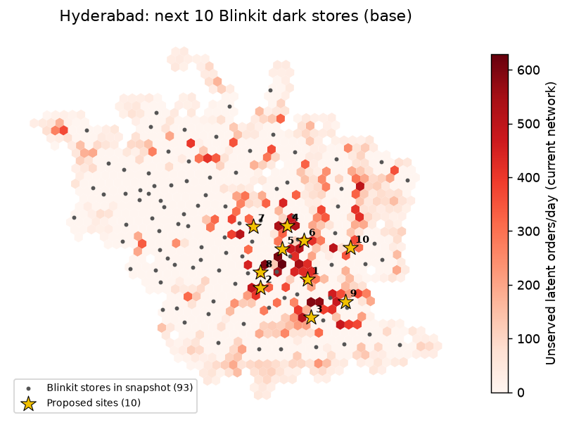
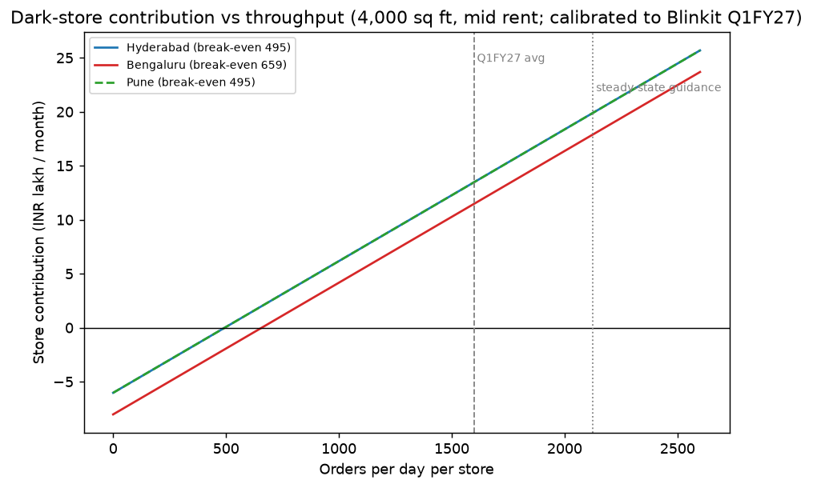

# Hyperlocal Network Planner

**Where should a 10–30 minute delivery business open its next dark stores — and which city should it enter next?**

A decision-support engine that answers this with public data alone: population + points-of-interest
demand modeling, a road-network reach model validated against real competitor delivery zones, a
unit-economics model calibrated to a public company's own disclosed numbers, and a capacity-constrained
site-selection optimizer — run end-to-end across three Indian cities (Hyderabad, Bengaluru, Pune) and
validated by holding out real dark-store locations and checking whether the model finds them.

Built solo over ~3 weeks as a portfolio project. No proprietary data anywhere in the pipeline.

## The headline result

Across all three cities, the model's top-10 site recommendations were tested by hiding 20% of each
city's real Blinkit stores and asking the optimizer to re-find good locations with no knowledge of
where they'd been. Pooled across all 325 held-out stores, it recovered real store locations within
1.5 km **1.7× as often as ranking sites by a simple demand score, and 2.0× as often as random
placement** — the gap was largest in Bengaluru and Pune, and within noise in Hyderabad (see table).

| City | Latent demand/day | Served by existing network | +10 sites → served | Model beats demand-ranking by |
|---|---|---|---|---|
| Hyderabad | 206,463 orders | 67.6% | 77.6% | not significant |
| Bengaluru | 322,808 orders | 74.0% | 80.3% | **43.3% vs 22.7% recall** |
| Pune | 158,052 orders | 74.4% | **87.3%** | 40.0% vs 21.2% recall |

*(Recall = share of held-out real stores the model's proposed sites land within 1.5 km of, averaged
over 5 random holdout draws per city. "Latent demand" and "served" are the model's own calibrated
estimates, not disclosed company figures — see Methodology.)*

Full per-city write-ups with named localities: [`reports/expansion_memo_hyderabad.md`](reports/expansion_memo_hyderabad.md) · [`reports/expansion_memo_bengaluru.md`](reports/expansion_memo_bengaluru.md) · [`reports/expansion_memo_pune.md`](reports/expansion_memo_pune.md) · [`reports/city_comparison.md`](reports/city_comparison.md)

## Follow-up: what real store networks reveal

The three operators site stores using order data nobody outside can see, so their networks are
evidence about that demand. A spatial entry model (`src/planner/revealed_demand.py`) asks where
a brand is likely to put a store, given its own spacing and where competitors already are.
Hiding a brand *and* a city from fitting and re-placing the brand's network, it lands on the
exact real store hex **2.4× as often as the v1 demand index** (27.1% vs 11.5%, better in 9 of
9 held-out networks). The honest twist: public demand features add nothing once competitors'
locations are known. Spacing, which the earlier hex-by-hex ML model missed, and competitor
co-location carry the signal. Write-up, per-brand strategy differences and a whitespace list:
[`reports/revealed_demand.md`](reports/revealed_demand.md). *(Features for this study were
rebuilt from Overture Maps + Meta HRSL, so its numbers are not directly comparable to the table
above.)*

## What it looks like

 

*Left: recommended next-10 sites for Hyderabad, colored by unserved demand. Right: store contribution
vs. order throughput, calibrated to a public company's disclosed unit economics — the two cities with
identical rent assumptions overlap, which is why one line is dashed.*

An interactive Streamlit version lets you change city, assumptions, and site count live:
```
.venv/Scripts/streamlit.exe run app/app.py
```

## Method, in five layers

1. **Demand.** WorldPop population + OpenStreetMap points-of-interest (offices, food/retail, education,
   residential density) combined into a within-city percentile demand score per H3 hex (~0.74 km²
   cells). A second weighting scheme is included as a labeled sensitivity scenario, not a second truth.
2. **Reach.** A drive-time isochrone from each candidate site, calibrated against **315 real Zepto
   delivery zones**: tested straight-line radius, a road-network model, and a gap-filled road-network
   model, and found them statistically tied (pooled IoU 0.51 vs. 0.50 vs. 0.48). Radius is the default
   *because it's simpler and equally accurate here*, not because roads don't matter — that finding came
   from measuring it, not assuming it.
3. **Unit economics.** Calibrated to a public company's own disclosed quarterly shareholder letter
   (order volume, gross profit, contribution, EBITDA — five quarters). Store rent by city comes from a
   secondary market-rent source; every other input is either disclosed or explicitly labeled an
   assumption, swept across 81 scenarios rather than asserted as one number. This produces a per-city
   break-even orders/day floor used as a hard constraint in the optimizer.
4. **Site selection.** A capacitated maximal-covering location model (PuLP/CBC): existing stores stay
   open, up to N new sites are added, each must clear its city's break-even floor, and demand can split
   across any store within reach — so cannibalization of existing stores is measured, not ignored.
5. **Validation.** The result at the top of this page: hide real stores, see if the model re-finds
   them, compare against two naive baselines.

## Repo structure

```
config/          city boundaries, demand weights, unit-economics inputs, network assumptions
src/planner/     the actual engine — grid, demand, reach, economics, optimize, orders, holdout
scripts/         one script per pipeline stage (build_*, optimize_network, validate_holdout, build_memo)
app/             the interactive Streamlit simulator + cloud-kitchen discovery mode
tests/           84 tests covering every module above
reports/         every generated map, table, and memo referenced in this README
```

Run the full pipeline for a city:
```bash
PYTHONPATH=src python scripts/build_study_area.py --city hyderabad
PYTHONPATH=src python scripts/build_demand.py --city hyderabad
PYTHONPATH=src python scripts/build_stores.py
PYTHONPATH=src python scripts/build_coverage.py --city hyderabad
PYTHONPATH=src python scripts/optimize_network.py --city hyderabad --curve
PYTHONPATH=src python scripts/validate_holdout.py --city hyderabad
PYTHONPATH=src python scripts/build_memo.py --city hyderabad
```
Or just the tests: `PYTHONPATH=src python -m pytest -q`.

## Data sources (every one either public or clearly labeled)

| Input | Source | Notes |
|---|---|---|
| Population | WorldPop India, 100m, 2026 constrained | |
| City boundaries, POIs, road network | OpenStreetMap (via `osmnx`) | |
| Dark-store locations (3 brands) | A public, unofficial GitHub mirror of the apps' own store-locator endpoints, March 2026 snapshot | Unlicensed third-party data — used for validation only, never redistributed; kept out of git |
| Delivery zone polygons (for reach validation) | Same source, one brand | |
| Pincode boundaries | A public GitHub mirror of India Post boundary shapefiles | The matching pincode *directory* was found to have 22% placeholder coordinates and was rejected in favor of the boundary polygons |
| Unit economics | A public company's own quarterly shareholders' letter | Primary source; page-cited in `CONTEXT.md` |
| Store rent by city | A secondary market-rent brokerage report | Labeled as secondary, given as a range, never a point estimate |

## Honest limitations

- The store-location snapshot is ~87% complete against each brand's disclosed store count and is
  three months old by the time of the holdout test — some of what looks like "capacity relief" in the
  optimizer's output may really be orders belonging to a store missing from the snapshot.
- One city (Hyderabad) shows no statistically significant edge over a simple demand-ranking heuristic
  in the holdout test. That's reported as a finding, not hidden.
- The reach model is validated against one brand's zones; it's assumed, not proven, to generalize to
  the others.
- Store capacity is the single most consequential unassessed assumption in the whole model — the
  Streamlit app exposes it as a slider specifically because of this.

## Stack

Python 3.14 · geopandas · h3-py · osmnx · PuLP/CBC · DuckDB · Streamlit · pydeck · pytest
