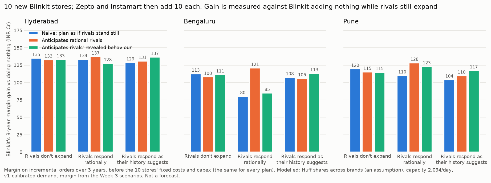

# Competitor response: which new sites still pay once rivals react?

*Code: `src/planner/competition.py`, `scripts/analyze_competition.py`, `scripts/plot_competition.py`.
Data: `reports/competition_summary{,_beta1,_f5}.csv` (every plan × follower model × city),
`competition_regret*.csv` (worst-case regret), `competition_sites*.csv` (the plans, with names).*

## The question

Every plan in this project so far, v1's included, picks sites as if Zepto and Instamart stand
still. They don't: all three are expanding in the same cities. And the revealed-demand study found
they **co-locate** (λ ≈ −2.5 to −3.5 for every brand). So:

- How much of a plan's promised value survives the competitors' next moves?
- Should Blinkit plan differently if it expects them?
- What should it pick if it doesn't know *how* they will respond?

## The game

- **Market.** In every hex, category demand is split across *all* brands' stores in reach. Each
  store gets a share proportional to 1/distance², the repo's Huff form (`huff.py`), with a 0.32 km
  within-hex floor. Each store serves at most 2,094 orders/day of its brand's share.
- **Calibration.** Category demand is backed out so that, with today's real networks, Blinkit's
  share reproduces v1's calibrated Blinkit orders in every hex exactly (checked: +0.00 orders/day
  in all three cities). So everything the game changes comes from shifts in market share.
- **Moves.** Blinkit (the leader) adds 10 stores. Then Zepto, and then Instamart (the followers),
  each add 10, seeing what came before.
- **How the followers respond** (two models, since nobody outside knows the truth):
  - **Rational:** each follower greedily adds the stores that maximise its own served orders.
  - **Behavioural:** each follower places stores where its *fitted revealed-demand model* expects
    them, i.e. how that brand has actually built so far (strong spacing, strong co-location).
- **Blinkit's plans:**
  - **Naive:** greedy on its own orders with rivals frozen. This is how v1 thinks.
  - **Anticipates rational rivals:** each candidate site is scored *after* the rational
    followers' response to it (a Stackelberg lookahead).
  - **Anticipates revealed behaviour:** the same, against the behavioural followers.
- **The score** is Blinkit's extra orders from the plan vs **Blinkit adding nothing while the
  rivals still expand**, since they are expanding either way. Rupees are margin × orders over 3
  years at ₹40.7/order. That's before the 10 stores' fixed costs and capex, which are identical
  across plans, so the differences are real money.

## Results



Base case: 10 stores per brand, Huff decay β = 2. Orders/day, with ₹ Cr over 3 years:

| City | Naive plan: promised (rivals frozen) | … if rivals respond rationally | … if they respond as history suggests | Anticipating rational rivals, under that response | Anticipating revealed behaviour, under that response |
|---|---|---|---|---|---|
| Hyderabad | 30,336 (₹135 Cr) | 29,978 (−1.2%) | 28,912 (−4.7%) | 30,788 (**+₹3.6 Cr** vs naive) | 30,686 (**+₹7.9 Cr**) |
| Bengaluru | 25,270 (₹113 Cr) | 18,013 (**−28.7%**) | 24,120 (−4.6%) | 27,119 (**+₹40.5 Cr**) | 25,417 (**+₹5.8 Cr**) |
| Pune | 26,846 (₹120 Cr) | 24,694 (−8.0%) | 23,357 (−13.0%) | 28,784 (**+₹18.2 Cr**) | 26,335 (**+₹13.3 Cr**) |

**Worst-case regret.** For each plan, this is the shortfall against the best plan in each response
scenario (rivals frozen, rational, behavioural), taking the worst of the three. Orders/day:

| City | Naive | Anticipates rational | Anticipates revealed behaviour |
|---|---|---|---|
| Hyderabad | 1,775 | **1,284** | 2,160 |
| Bengaluru | 9,107 | **1,629** | 8,052 |
| Pune | 4,090 | 1,691 | **1,125** |

### What this shows

1. **A plan that ignores rivals overstates its own value.** Across the base run and both
   sensitivity runs, the naive plan delivers up to 29% less than promised when rivals respond
   rationally (Bengaluru, base), and 2–16% less when they respond as their history suggests.
2. **Anticipating the response pays, if you anticipate the right one.**
   - The plan built for a response beats the naive plan under that response in **18 of 18**
     comparisons (3 cities × 3 runs × 2 response models).
   - The gain is +2 to +51% of the plan's extra orders against rational rivals, and +3 to +18%
     against behavioural ones.
   - In the base run that's ₹3.6–40.5 Cr over 3 years for the same 10 stores.
3. **The cost of anticipating when rivals don't move is small:** 0.3–7% of the naive plan's
   value. So the downside is bounded while the upside can be large.
4. **When the response is unknown, the rational-rivals plan is the robust default.**
   - A response-aware plan has the lowest worst-case regret in 8 of 9 city × run cases, and the
     rational-rivals plan specifically in 7.
   - The exception: Hyderabad when rivals add only 5 stores each, where the naive plan's worst
     case is smallest.
   - Planning for the *wrong* response model can be worse than naive, e.g. the behavioural plan
     under rational rivals in Hyderabad. That's why regret, not any single scenario, is the way
     to choose.
5. **Anticipating rivals doesn't mean avoiding them.** In Hyderabad and Pune, the sites the
   response-aware plans add have *more* rival stores in reach than the naive sites they replace
   (4.0 vs 2.5 in Hyderabad, 3.8 vs 3.0 in Pune). The rational-aware Bengaluru plan keeps only 2
   of the naive plan's 10 sites and moves into areas where Blinkit's share is lowest today (26% vs
   42%): it takes the ground rivals would otherwise take. Under rational response (base run), 5–10
   of every 10 Blinkit sites sit within 1 km of a spot a rival would have taken had Blinkit done nothing.
   These are averages over a handful of sites per city; read them as description, not law.

**Sensitivity** (full tables in `competition_summary_beta1.csv` / `_f5.csv`):
- **Flatter distance decay (β = 1):** a store pulls customers from further away. Every conclusion
  holds, and the gains from anticipating are larger: +19 to +36% against rational rivals,
  +4 to +18% against behavioural ones.
- **Rivals add only 5 stores each:** gains are smaller (+2 to +20%, +3 to +7%). This is also where
  the one exception to finding 4 appears.

## Assumptions and limitations

- **Cross-brand choice is not validated.** `huff.py` was validated on *which Zepto store* serves a
  hex (`huff_validation_zepto.csv`). Using the same 1/distance² rule to split demand *between
  brands* assumes customers weigh brands only by proximity: equal attractiveness, no loyalty,
  price or assortment effects.
- **Demand level.** Category demand is inferred from Blinkit's calibrated orders and its modelled
  share. Nothing here observes Zepto's or Instamart's actual orders. All brands get the same
  store capacity.
- **Simplified dynamics.** One round, one fixed move order (Blinkit, then Zepto, then Instamart),
  equal store budgets. No price response, no closures, no later rounds.
- **The "rational" follower is a greedy heuristic,** not a proven best response, and only
  considers its 60 best candidate sites under today's networks.
- **Order-level margin only:** the objective is margin on orders. Rival stores' fixed costs and
  profits are not modelled, so "rational" means order-maximising.
- **Features.** Overture + Meta HRSL (see `revealed_demand.md`); Pune's study area is approximated.

## Reproduce

```bash
PYTHONPATH=src python scripts/analyze_competition.py                     # ~1.5 min (3 cities in parallel)
PYTHONPATH=src python scripts/analyze_competition.py --beta 1.0 --tag _beta1
PYTHONPATH=src python scripts/analyze_competition.py --followers-per 5 --tag _f5
PYTHONPATH=src python scripts/plot_competition.py
python -m pytest tests/test_competition.py
```
