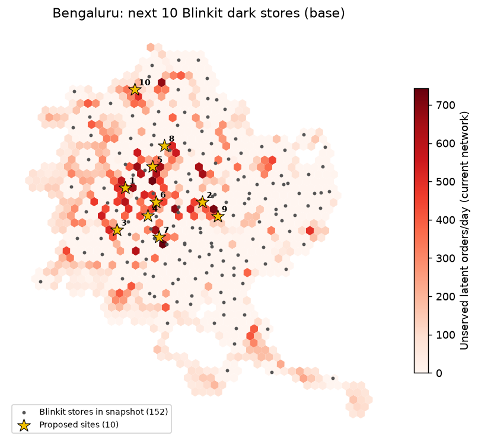

# Bengaluru: where Blinkit should open its next 10 dark stores (memo v1)

## Answer

- **Core picks** (proposed in at least 4 of 6 model runs across scenarios): **Malleswaram** (560003), **K H B Colony** (560079), **Nal** (560017), **Vidyaranyapura** (560097).
- Under the base scenario, 10 new sites add **20,230 orders/day**, lifting served demand from 74.0% to 80.3%.
- In that base solution, 10,369 site orders/day come from areas no Blinkit store reaches today and 9,862 relieve stores already at capacity.
- Picks outside the core move with assumptions (store capacity above all). Treat them as areas to scout, not addresses.

## Robust areas (sites within 1 km grouped across all 6 runs)

| Area | Pincode | Lat, Lng | Runs proposing it | Median incremental orders/day | New-coverage share | Competitor stores (median) |
|---|---|---|---|---|---|---|
| Malleswaram | 560003 | 13.0010, 77.5781 | 6/6 | 2,094 | 70% | 2 |
| K H B Colony | 560079 | 12.9861, 77.5378 | 4/6 | 2,094 | 92% | 2 |
| Nal | 560017 | 12.9559, 77.6448 | 4/6 | 1,951 | 95% | 2 |
| Vidyaranyapura | 560097 | 13.0833, 77.5522 | 4/6 | 1,907 | 100% | 0.5 |
| Agram | 560007 | 12.9709, 77.6239 | 3/6 | 2,094 | 92% | 1 |
| Jayangar Iii Block | 560011 | 12.9262, 77.5812 | 3/6 | 2,094 | 0% | 2 |
| Nayandahalli | 560039 | 12.9413, 77.5266 | 3/6 | 2,094 | 83% | 0 |
| Rajajinagar | 560010 | 12.9861, 77.5485 | 3/6 | 2,094 | 37% | 2 |
| Basavanagudi | 560004 | 12.9561, 77.5690 | 2/6 | 2,094 | 36% | 2 |
| Girinagar (Bangalore) | 560085 | 12.9263, 77.5516 | 2/6 | 2,094 | 26% | 2 |
| Training Command Iaf | 560006 | 13.0159, 77.5826 | 2/6 | 2,094 | 48% | 0 |
| H.A. Farm | 560024 | 13.0309, 77.5871 | 2/6 | 2,038 | 0% | 2 |
| Chickpet | 560053 | 12.9711, 77.5734 | 2/6 | 1,968 | 22% | 0 |
| Krishnarajapuram | 560036 | 13.0118, 77.6985 | 2/6 | 1,906 | 90% | 1.5 |
| Jayanagar | 560029 | 12.9373, 77.5960 | 2/6 | 1,847 | 0% | 1.5 |

## Base-scenario solution (10 sites)

| Site | Locality | Pincode | Lat, Lng | Incremental orders/day | New coverage / capacity relief | Competitor stores reaching | Robust (scenarios) |
|---|---|---|---|---|---|---|---|
| 1 | K H B Colony | 560079 | 12.98613, 77.54420 | 2,094 | 2,094 / 0 | 2 | 5/5 |
| 2 | H.A.L Ii Stage | 560008 | 12.97089, 77.62819 | 2,094 | 1,565 / 530 | 1 | 2/5 |
| 3 | Governmemnt Electric Factory | 560026 | 12.94128, 77.53503 | 2,094 | 1,449 / 645 | 1 | 2/5 |
| 4 | Basavanagudi | 560004 | 12.95613, 77.56896 | 2,094 | 777 / 1,318 | 2 | 1/5 |
| 5 | Sadashivanagar | 560080 | 13.00848, 77.57405 | 2,094 | 449 / 1,646 | 2 | 4/5 |
| 6 | Chickpet | 560053 | 12.97106, 77.57764 | 2,094 | 449 / 1,646 | 0 | 1/5 |
| 7 | Jayangar Iii Block | 560011 | 12.93364, 77.58122 | 2,094 | 0 / 2,094 | 2 | 2/5 |
| 8 | H.A. Farm | 560024 | 13.03088, 77.58706 | 1,983 | 0 / 1,983 | 2 | 1/5 |
| 9 | Nal | 560017 | 12.95586, 77.64479 | 1,808 | 1,808 / 0 | 2 | 3/5 |
| 10 | Vidyaranyapura | 560097 | 13.09081, 77.55437 | 1,778 | 1,778 / 0 | 0 | 3/5 |

Robust = number of alternative scenarios that still place a site within 1 km.

## Scenarios

| Scenario | Incremental orders/day (top 10) | Base sites kept within 1 km |
|---|---|---|
| Adoption elasticity 0 (population only) | 20,499 | 5/10 |
| Adoption elasticity 1 (fully POI-driven) | 20,940 | 5/10 |
| Demand growth x1.5 | 20,940 | 4/10 |
| Store capacity 1,600 orders/day | 16,000 | 4/10 |
| Store capacity 3,000 orders/day | 20,935 | 6/10 |

## Does the model find where Blinkit actually builds? (hold-out validation)

20% of real Blinkit stores are hidden, 5 times; each method proposes the same number of sites. Recall = hidden stores with a proposed site within 1.5 km.

| method | recall | precision | median_km_true_to_pred |
|---|---|---|---|
| optimiser | 43% | 48% | 1.96 |
| top_unserved_hexes | 27% | 36% | 3.45 |
| random_pop_weighted | 23% | 24% | 2.51 |
| top_demand_index | 23% | 37% | 3.11 |

## Method (one paragraph)

Latent orders/day per H3 hex = population × a POI-based adoption multiplier, calibrated so hexes Blinkit covers today carry its disclosed throughput (Eternal Q4 FY26: 1,462 orders/day/store; snapshot store completeness 87%). A capacitated maximal-covering model (PuLP/CBC) keeps existing stores open, adds up to N sites that must clear the city's break-even orders/day (Week 3 unit economics), and lets hex demand split across any store within the calibrated 10-minute radius. Per-site gains are leave-one-out.

## Caveats

- Store locations are a third-party March 2026 snapshot (unlicensed, ~87% complete); some 'capacity relief' may be stores missing from it.
- One national capacity and throughput for every store; no city-specific order value or margins.
- Adoption multiplier weights are assumptions (swept in Scenarios); OpenStreetMap POI coverage varies by area.
- Competitor share is not modelled in demand; competitor presence is shown for context only.

