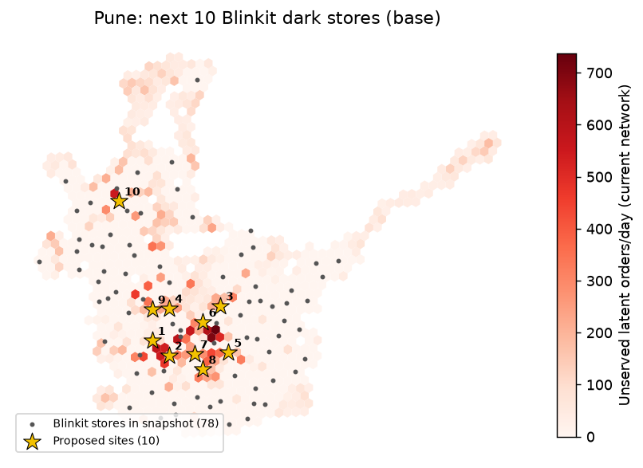

# Pune: where Blinkit should open its next 10 dark stores (memo v1)

## Answer

- **Core picks** (proposed in at least 4 of 6 model runs across scenarios): **Kothrud** (411038), **Aundh T.S.** (411007), **Pune** (411001).
- Under the base scenario, 10 new sites add **20,268 orders/day**, lifting served demand from 74.4% to 87.3%.
- In that base solution, 7,543 site orders/day come from areas no Blinkit store reaches today and 12,726 relieve stores already at capacity.
- Picks outside the core move with assumptions (store capacity above all). Treat them as areas to scout, not addresses.

## Robust areas (sites within 1 km grouped across all 6 runs)

| Area | Pincode | Lat, Lng | Runs proposing it | Median incremental orders/day | New-coverage share | Competitor stores (median) |
|---|---|---|---|---|---|---|
| Kothrud | 411038 | 18.5090, 73.8266 | 5/6 | 2,094 | 56% | 1 |
| Aundh T.S. | 411007 | 18.5451, 73.8308 | 4/6 | 1,934 | 66% | 0 |
| Pune | 411001 | 18.5358, 73.8635 | 4/6 | 1,908 | 37% | 1 |
| Yerwada T.S. | 411006 | 18.5475, 73.8800 | 3/6 | 2,094 | 47% | 0 |
| Narayan Peth | 411030 | 18.5065, 73.8491 | 3/6 | 2,094 | 21% | 0 |
| Afmc | 411040 | 18.5047, 73.8880 | 3/6 | 2,042 | 52% | 2 |
| Narayan Peth | 411030 | 18.4950, 73.8306 | 3/6 | 2,023 | 19% | 0 |
| Kothrud | 411038 | 18.5156, 73.8143 | 2/6 | 2,094 | 69% | 2 |
| Akurdi | 411035 | 18.6538, 73.7760 | 2/6 | 2,053 | 3% | 1.5 |
| T.V. Nagar | 411037 | 18.4892, 73.8633 | 2/6 | 1,934 | 21% | 0 |
| Aundh T.S. | 411007 | 18.5480, 73.8165 | 2/6 | 1,934 | 19% | 1 |
| Armament | 411021 | 18.5472, 73.8001 | 2/6 | 1,847 | 2% | 3 |
| Yerwada T.S. | 411006 | 18.5583, 73.8821 | 2/6 | 1,786 | 77% | 0 |
| Akurdi | 411035 | 18.6433, 73.7821 | 2/6 | 1,670 | 9% | 1 |
| Parvati | 411009 | 18.4921, 73.8490 | 2/6 | 1,504 | 39% | 0 |

## Base-scenario solution (10 sites)

| Site | Locality | Pincode | Lat, Lng | Incremental orders/day | New coverage / capacity relief | Competitor stores reaching | Robust (scenarios) |
|---|---|---|---|---|---|---|---|
| 1 | Kothrud | 411038 | 18.51560, 73.81432 | 2,094 | 1,207 / 887 | 2 | 2/5 |
| 2 | Navsahyadri | 411052 | 18.50201, 73.83064 | 2,094 | 708 / 1,387 | 0 | 4/5 |
| 3 | Yerwada T.S. | 411006 | 18.54747, 73.87999 | 1,773 | 1,398 / 696 | 0 | 3/5 |
| 4 | Aundh T.S. | 411007 | 18.54512, 73.83083 | 1,773 | 1,074 / 806 | 0 | 3/5 |
| 5 | Afmc | 411040 | 18.50473, 73.88799 | 1,773 | 922 / 1,173 | 2 | 2/5 |
| 6 | Pune | 411001 | 18.53231, 73.86353 | 1,773 | 762 / 1,332 | 1 | 3/5 |
| 7 | Guruwar Peth | 411042 | 18.50318, 73.85521 | 1,773 | 447 / 1,647 | 0 | 3/5 |
| 8 | T.V. Nagar | 411037 | 18.48919, 73.86334 | 1,773 | 403 / 1,692 | 0 | 1/5 |
| 9 | Baner Road | 411008 | 18.54434, 73.81445 | 1,773 | 330 / 1,657 | 1 | 2/5 |
| 10 | Akurdi | 411035 | 18.64330, 73.78212 | 1,741 | 292 / 1,449 | 1 | 2/5 |

Robust = number of alternative scenarios that still place a site within 1 km.

## Scenarios

| Scenario | Incremental orders/day (top 10) | Base sites kept within 1 km |
|---|---|---|
| Adoption elasticity 0 (population only) | 20,050 | 6/10 |
| Adoption elasticity 1 (fully POI-driven) | 20,323 | 6/10 |
| Demand growth x1.5 | 20,940 | 4/10 |
| Store capacity 1,600 orders/day | 16,000 | 3/10 |
| Store capacity 3,000 orders/day | 13,653 | 6/10 |

## Does the model find where Blinkit actually builds? (hold-out validation)

20% of real Blinkit stores are hidden, 5 times; each method proposes the same number of sites. Recall = hidden stores with a proposed site within 1.5 km.

| method | recall | precision | median_km_true_to_pred |
|---|---|---|---|
| optimiser | 40% | 45% | 2.38 |
| top_unserved_hexes | 26% | 55% | 4.37 |
| top_demand_index | 21% | 49% | 4.42 |
| random_pop_weighted | 18% | 19% | 3.09 |

## Method (one paragraph)

Latent orders/day per H3 hex = population × a POI-based adoption multiplier, calibrated so hexes Blinkit covers today carry its disclosed throughput (Eternal Q4 FY26: 1,462 orders/day/store; snapshot store completeness 87%). A capacitated maximal-covering model (PuLP/CBC) keeps existing stores open, adds up to N sites that must clear the city's break-even orders/day (Week 3 unit economics), and lets hex demand split across any store within the calibrated 10-minute radius. Per-site gains are leave-one-out.

## Caveats

- Store locations are a third-party March 2026 snapshot (unlicensed, ~87% complete); some 'capacity relief' may be stores missing from it.
- One national capacity and throughput for every store; no city-specific order value or margins.
- Adoption multiplier weights are assumptions (swept in Scenarios); OpenStreetMap POI coverage varies by area.
- Competitor share is not modelled in demand; competitor presence is shown for context only.

