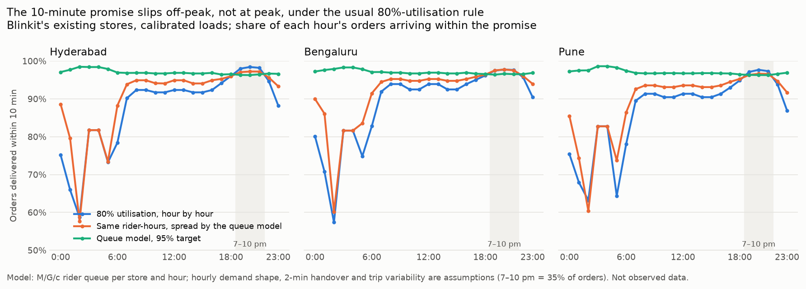
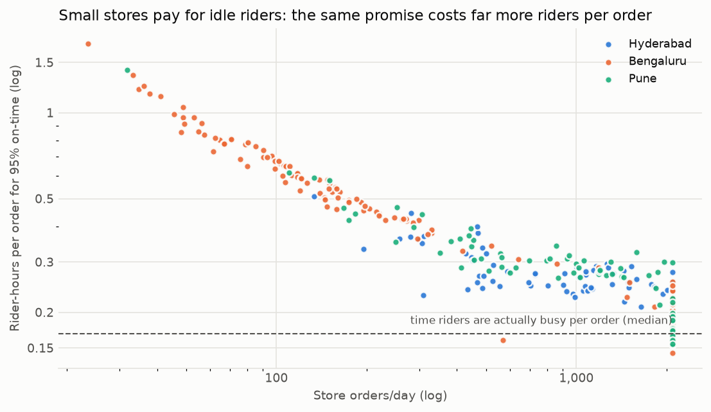

# The 10-minute promise and the rider queue

*Code: `src/planner/peak_sla.py`, `scripts/analyze_peak_sla.py`, `scripts/plot_peak_sla.py`.
Data: `reports/peak_sla_summary.csv` (every city × policy × case), `peak_sla_hourly.csv`,
`peak_sla_rosters.csv` (riders per store per hour), `peak_sla_hex_{city}.csv` (per-hex on-time at
3 pm and 8 pm), `peak_sla_pooling.csv`, `peak_sla_network_whatif.csv`.*

## The question

v1 gives every store a fixed 10-minute catchment: the distance a rider covers in 10 minutes minus
2.5 minutes of picking (1.625 km in Hyderabad and Pune, 1.375 km in Bengaluru). That radius
silently assumes a rider is free the instant an order is packed. So a customer at the edge is on
time only if the wait for a rider is exactly zero.

How much of the promise survives once riders have to be queued for, and what does it cost to keep?

**The pitch was that the promise breaks at the evening peak. On the real Blinkit networks, under
the staffing rule most operators use, it doesn't: it breaks off-peak.** That turned out to be the
more useful finding.

## The model

For each existing Blinkit store and each hour of the day:
- **Orders** are the store's calibrated served orders (v1's capacitated assignment, routed to the
  nearest store with capacity) × that hour's share of the day.
- **A rider trip** is out and back plus a 2-minute handover. Each store has its own mix of order
  distances, which sets its riders' service rate.
- **Riders** are a multi-server queue: M/G/c, using the Erlang-C probability of waiting and an
  Allen–Cunneen correction for trip-time variability.
- **An order is on time** if picking + rider wait + ride ≤ 10 minutes.

The queue formula is checked against a discrete-event simulation of 300,000 orders in the tests.

**Assumptions**, all labelled:
- **Hourly shape of demand.** 7–10 pm carries 35% of the day's orders; 45% is a sensitivity. The
  35% comes from secondary blog sources citing industry reports, and Blinkit's 6–9 pm peak window
  shapes the curve. No primary hourly data exists in this project.
- **Handover:** 2 minutes.
- **Trip variability:** SCV 0.25 on top of the distance mix.
- **Rider cost:** ₹120 per rider-hour, from reported pay of ₹25–50 per order at 3–4 orders an hour.

**Staffing policies compared** (riders per store per hour):

| Policy | Rule |
|---|---|
| **80% utilisation** | Riders each hour = load ÷ 0.8. The common rule of thumb |
| **Queue model, 95%** | Riders each hour = fewest that deliver 95% on time, given the store's distance mix |
| **Same rider-hours, redistributed** | The 80% rule's total rider-hours, spread by the queue model to maximise on-time orders |

**Model check.** The model's rider productivity is 4.2–4.7 orders per rider-hour, against the
reported 3–4. It is somewhat optimistic, probably because it ignores time riders spend waiting at
the store for packing, and breaks. It was not fitted to that figure.

## Results



Base case below: 7–10 pm = 35% of orders, loads from the demand map. The same rows with 45% at
peak, and with every store at Blinkit's disclosed average of about 1,463 orders/day, are in
`peak_sla_summary.csv`; every conclusion below holds in all of them.

| | Hyderabad | Bengaluru | Pune |
|---|---|---|---|
| Orders served / day (93 / 153 / 77 stores) | 119,367 | 129,543 | 90,603 |
| **80% rule:** late orders / day (share) | 7,246 (6.1%) | 7,048 (5.4%) | 6,373 (7.0%) |
| … of which *outside* 7–10 pm | 85% | 80% | 82% |
| … on time at 8 pm / at 3 pm | 98.4% / 91.7% | 97.8% / 92.5% | 97.7% / 90.5% |
| … distance still reached on time for 90% of orders, median store, 3 pm (nominal radius) | 1.04 km (1.625) | 0.13 km (1.375) | 0.84 km (1.625) |
| … 3 pm orders from hexes where < 80% arrive on time | 11.8% | 8.3% | 17.4% |
| **Queue model, 95%:** late orders | **−44%** | **−40%** | **−52%** |
| … extra rider-hours | +5.9% | +8.7% | +8.6% |
| … cost per late order avoided (₹120/rider-hour) | ₹57 | ₹102 | ₹62 |
| … riders on the road at 8 pm vs the 80% rule | **−6.7%** | **−4.8%** | **−4.8%** |
| **Same rider-hours, redistributed:** late orders | **−21%** | **−23%** | **−18%** |

### What this shows

1. **The promise slips in the quiet hours, not at the peak.** Under the 80% rule, 79–92% of late
   orders (across every case) fall outside 7–10 pm. On-time is 97–98% at 8 pm but 90–93% in the
   afternoon, and dips to 57–63% around 2 am.

   The mechanism is queueing, not geography. The same 80% utilisation is very safe for a
   30-rider evening fleet and very risky for a 4-rider afternoon one, because a big pool almost
   always has someone free. At 3 pm, the distance a median store can still reach on time for 90%
   of orders falls to 52–64% of its nominal radius in Hyderabad and Pune, and to 0.13 km for
   Bengaluru's many lightly-loaded stores.
2. **Staffing from the queue model fixes most of it for 6–9% more rider-hours** (4–9% across all
   cases). Late orders fall by 40–52% (37–52% across all cases), at ₹52–102 per late order
   avoided. It does this with *fewer*
   riders at 8 pm than the 80% rule, which over-staffs the peak, and more in the afternoon and
   overnight.
3. **Just redistributing the existing rider-hours removes 12–33% of late orders at no extra
   cost.** This is the cheapest decision in this study, and it needs nothing but a better rule.
4. **Small stores pay for idle riders** (chart below). Rider-hours per order fall steeply with
   store volume (correlation of −0.8 to −0.9 with log orders/day). The smallest quarter of stores
   need 1.6–4.3× the rider-hours per order of the largest quarter (Hyderabad 0.32 vs 0.20,
   Bengaluru 0.80 vs 0.18, Pune 0.40 vs 0.17). Every store must keep a few riders free whatever
   its volume.
5. **What this means for siting.**
   - A store's cost of keeping the promise is not a constant per order; it scales with its
     volume.
   - Adding the rollout plan's wave-1 stores, which run near capacity, lowers network rider-hours
     per order under queue-model staffing by 3.4–7.8% (`peak_sla_network_whatif.csv`), and mean
     trip distance falls by 2–3%.
   - Conversely, a site whose catchment would stay small is costlier to run than v1's per-order
     economics assume. v1's unit economics should carry a store-size-dependent rider cost.
6. **Some lateness is geography, not riders.** In Hyderabad and Pune, orders in the outer 20% of
   the radius are a third to a half of the remaining late orders under queue-model staffing (33%
   and 46% in the base case; up to 60% in the disclosed-average rerun). Any wait at all
   makes them late. Bengaluru's shorter radius holds no hex centres in that band at H3 resolution 8.



## Outputs you can use

- **`peak_sla_rosters.csv`:** riders per hour (h00–h23) for every existing Blinkit store under
  the queue-model policy, with its peak riders and daily rider-hours. The median store needs 33
  riders at peak in Hyderabad and Pune, and 8 in Bengaluru, where the demand map spreads orders
  thin.
- **`peak_sla_hex_{city}.csv`:** per-hex on-time share at 3 pm and 8 pm under the 80% rule. This
  is the at-risk map, and it is an afternoon map, not an evening one.

## Limitations

- **Hourly demand shape.** It is an assumption anchored to one secondary figure. The conclusions
  hold at a 45% evening share, but a much flatter or spikier real curve would move the numbers.
- **Rider supply is assumed unlimited.** The model staffs whatever it asks for. The real evening
  problem is often rider *supply* (rain, shift gaps, gig riders logging off), which this model
  does not represent. So "the peak is fine" means fine *if staffed as planned*.
- **No order batching,** which operators use at peak to stretch riders. It would lower the peak
  rider numbers further.
- **Pickers are not modelled.** Picking is a fixed 2.5 minutes, with no picker queue.
- **Overloaded hours can't be described.** Steady-state formulas can't represent an hour where
  riders are fewer than the load. That's why a "flat roster sized from daily numbers" policy was
  dropped, rather than reported as 0% on time.
- **Loads come from the public-data demand map.** Its store-to-store skew is likely stronger than
  reality: Bengaluru has many near-empty stores, and the revealed-demand study found the map
  doesn't match where operators build. The disclosed-average rerun addresses this; the
  conclusions hold, and cost per late order avoided falls to ₹55–57.
- **Timing uses the calibrated straight-line speed.** That speed was fitted to Zepto zone sizes,
  which may already absorb some typical queueing. If so, absolute on-time rates are pessimistic,
  but the comparisons between policies are unaffected.

## Reproduce

```bash
PYTHONPATH=src python scripts/build_open_features.py      # if data/processed is empty
PYTHONPATH=src python scripts/analyze_peak_sla.py          # ~10 s
PYTHONPATH=src python scripts/plot_peak_sla.py
python -m pytest tests/test_peak_sla.py
```
