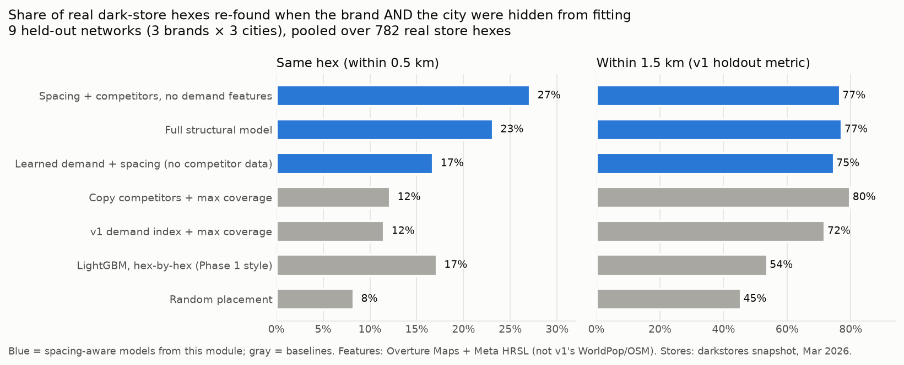

# Revealed demand: what do real dark-store networks tell us that public data can't?

*Code: `src/planner/revealed_demand.py`, `scripts/validate_revealed_demand.py`,
`scripts/build_open_features.py`. Data tables: `reports/revealed_demand_*.csv`. All numbers
below are computed, not targets; rerun with the commands at the end.*

## The question

Blinkit, Zepto and Instamart pick store sites using order data nobody outside can see. Their
782 real store hexes across Hyderabad, Bengaluru and Pune are therefore evidence about that
hidden demand. Can we get that evidence back out, and does it beat the v1 engine's hand-weighted
demand index?

Phase 1 (`ml_demand.py`) tried a direct version of this. It predicted "does this hex have a
store?" one hex at a time from public features, and got R² ≈ 0. **The diagnosis: stores are
spaced out on purpose.** A hex with excellent demand often has no store because a sibling store
1.5 km away already covers it. A model that looks at one hex at a time reads that deliberate
spacing as noise.

## The model

This treats each brand's network as the output of a coverage-maximising operator and fits the
demand weights under which the real networks look like good ones. It is a spatial entry model,
estimated by pseudo-likelihood; odds proportional to marginal catchment value is the
local-optimality condition of a covering problem, softened so that it can be fitted.

```
logit P(brand b has a store in hex i | every other store) = α[b,city] + log V_bi
V_bi = Σ_{j within reach of i}  exp(θ·z_j) · (1 + own_bj)^(−γ) · (1 + comp_bj)^(−λ)
```

- `z_j`: public features of hex j (population density, office / education / food-retail POIs,
  apartment buildings, all buildings, distance to centre).
- `own_bj`: how many of the brand's other stores already reach hex j.
- `comp_bj`: how many competitor stores reach hex j.
- `θ`: the recovered demand map.
- `γ > 0`: operators space their own stores out.
- `λ`: reaction to competitors. Positive means they avoid them; negative means they co-locate.

**Test.** Hide real networks and fit on the rest. Then re-place each hidden network greedily,
the same number of stores it really has, using the real positions of the other brands' stores,
which are public. Measure how many real store hexes the placed network lands on (within 0.5 km,
i.e. the same hex) or near (within 1.5 km, v1's holdout metric).

There are three protocols; the strictest hides the brand **and** the city from fitting. The
results are nearly identical across all three (see `revealed_demand_summary.csv`).

## Results: strictest protocol (brand and city both hidden), 9 held-out networks



| Method | Same hex (≤0.5 km) | ≤1.0 km | ≤1.5 km |
|---|---|---|---|
| Random placement | 8.3% | 44.1% | 45.5% |
| LightGBM, hex-by-hex (the Phase 1 approach) | 17.1% | 52.6% | 53.7% |
| **v1 demand index + max coverage** (today's engine logic) | 11.5% | 70.1% | 71.9% |
| Copy competitors + max coverage (heuristic) | 12.1% | 78.0% | **79.8%** |
| Learned demand + spacing, no competitor data | 16.8% | 72.6% | 74.7% |
| Full structural model | 23.1% | 76.7% | 77.2% |
| **Spacing + competitors, no demand features** | **27.1%** | 75.7% | 76.6% |

Wins against the v1 index, counted over the 9 held-out networks, with two-sided sign tests:
- **Full structural model:** better on same-hex recall in 9/9 (p = 0.004) and within 1.5 km in 8/9 (p = 0.04).
- **Spacing + competitors, no demand features:** better on same-hex recall in 9/9 (p = 0.004).

The nine networks share three cities, so they are not fully independent; read the p-values as
indicative.

### What this shows, stated plainly

1. **Spacing is the structural fact Phase 1 missed.** Every spacing-aware method beats
   hex-by-hex ranking by a wide margin: LightGBM re-finds 54% of stores within 1.5 km, the
   spacing-aware models 75–80%. Phase 1 was framed wrong, not just under-featured. The fitted
   spacing term is large for every brand: γ ≈ 3.7–4.5, with 90% intervals entirely above 3.3.
2. **Competitor co-location is the strongest public signal of demand.** λ is strongly negative
   for all three brands (pooled −2.9): stores go where competitors already are. Using that plus
   spacing, with no demand features at all, re-finds the exact hex **2.4× as often as the v1
   demand index** (27.1% vs 11.5%) and **3.3× as often as random** (8.3%), with the same result
   in every one of the 9 held-out networks.
3. **The original hypothesis did not hold: public demand features add nothing once competitors
   are known.** The full model never beats the no-features model on same-hex recall (0/9), and
   it ties it within 1.5 km. At 1.5 km, the plain "copy competitors" heuristic is best of all.
   Whatever operators know about demand is better reflected in each other's networks than in
   population and POI counts. This is consistent with Phase 1's R² ≈ 0; it is not a bug to fix.
4. **Without competitor data, learned weights still modestly beat the hand-set index.** They do
   better within 1.5 km in 8/9 networks (74.7% vs 71.9%) and on same-hex recall in 6/9 (16.8% vs
   11.5%, not significant). So for a market where no competitor has built yet, this is a small
   but real upgrade to v1's weights.

**Product implication.** v1 recommends sites from a hand-weighted demand index. For a city where
competitors already operate, a spacing-aware model driven by competitor coverage predicts where
real operators build far more precisely, and needs nothing but public store locations. The
demand index remains useful for greenfield markets and for explaining *why* an area is
attractive, but it is not the best predictor of where the stores actually go.

## How the three brands differ (competitive intelligence)

Per-brand fits pool all three cities. Intervals are 90% spatial block-bootstrap intervals
(100 reps, resampling H3 res-6 blocks of about 36 km² within each city).

| | Blinkit | Zepto | Instamart |
|---|---|---|---|
| γ own spacing | 4.37 [3.79, 5.17] | 3.67 [3.29, 4.70] | 4.48 [3.84, 5.96] |
| λ competitors | **−2.52** [−3.01, −2.13] | −3.23 [−3.90, −2.82] | **−3.49** [−4.41, −3.05] |
| office POIs | **+0.41** [0.01, 0.89] | −0.03 [−0.45, 0.54] | +0.04 [−0.58, 0.62] |
| education POIs | **+0.32** [0.03, 0.55] | −0.36 [−0.66, 0.05] | −0.25 [−0.63, 0.01] |
| all buildings | +0.10 [−0.23, 0.42] | **+0.89** [0.43, 1.35] | −0.00 [−0.54, 0.67] |
| apartment buildings | +0.03 [−0.23, 0.23] | **+0.26** [0.00, 0.56] | +0.18 [−0.02, 0.35] |

What this suggests, read as hypotheses rather than findings:
- **Blinkit** tilts toward office and college areas and co-locates the least. Its interval does
  not overlap Instamart's, which fits a market leader that others follow, but this snapshot has
  no opening dates, so the order of entry cannot be tested here.
- **Zepto** tilts toward dense built-up and apartment areas.

With 9 features × 3 brands and 90% intervals, one or two "significant" coefficients are expected
by chance. Only γ and λ are solidly established.

## Whitespace: gaps each brand's rivals say exist

`revealed_demand_whitespace.csv` lists, for each brand and city, the 10 hexes without a store of
that brand where the fitted model most expects one given everyone's networks, at least 1.5 km
apart. Place names are the nearest Overture neighbourhood. Top two per brand and city:

| City | Brand | Place | P(store) | Own stores in reach | Rival stores in reach |
|---|---|---|---|---|---|
| Hyderabad | Zepto | Vittal Rao Nagar (by HITEC City) | 0.75 | 0 | 5 |
| Hyderabad | Zepto | Whitefields | 0.68 | 1 | 3 |
| Hyderabad | Blinkit | Omkar Nagar | 0.47 | 0 | 3 |
| Hyderabad | Blinkit | KPHB Colony 9th Phase | 0.44 | 2 | 4 |
| Hyderabad | Instamart | Brindavan Colony | 0.37 | 1 | 3 |
| Hyderabad | Instamart | Srinivasa Colony | 0.32 | 1 | 3 |
| Bengaluru | Zepto | Old Binnamangala | 0.64 | 1 | 3 |
| Bengaluru | Zepto | Sudgunte Palya | 0.59 | 0 | 0 |
| Bengaluru | Blinkit | Craig Park Layout | 0.51 | 0 | 1 |
| Bengaluru | Blinkit | Kodihalli | 0.50 | 1 | 2 |
| Bengaluru | Instamart | Frazer Town | 0.46 | 0 | 3 |
| Bengaluru | Instamart | Happy Valley | 0.45 | 0 | 4 |
| Pune | Blinkit | Anupam Park | 0.36 | 1 | 4 |
| Pune | Blinkit | Viman Nagar | 0.33 | 1 | 4 |
| Pune | Zepto | Model Colony | 0.34 | 0 | 4 |
| Pune | Zepto | Katraj | 0.26 | 0 | 4 |
| Pune | Instamart | Balewadi High Street | 0.26 | 1 | 6 |
| Pune | Instamart | Punawale | 0.22 | 0 | 2 |

This is a model output, not a validated forecast. **It can be forward-tested:** re-scrape the
darkstores snapshot later and check whether these hexes gained stores more often than
comparable hexes. That would be the first genuinely predictive (not retrospective) test in this
project.

## Data, and how it differs from v1

- **Stores:** the same darkstores snapshot v1 used, byte-identical at pinned commit `059e3cc`
  (sha256 checked).
- **Features:** rebuilt from **Overture Maps** (release 2026-09-23: places, buildings,
  boundaries) and **Meta HRSL** population (~30 m). This session could not reach OSM or WorldPop
  servers. **Numbers here are not directly comparable to v1's WorldPop/OSM-based numbers.**
  The same study-area rule applies (municipal core + contiguous hexes ≥ 2,500/km², ribbons
  trimmed).
  - Hyderabad and Bengaluru use the *exact* v1 municipal polygons: Overture carries the pinned
    OSM relation ids, and the cores come out at 806 and 942 hexes, as in v1.
  - **Pune is approximated.** Its pinned sub-district polygon is not in Overture, so its core is
    an equal-area 312 km² disk around the city centre.
  - Study areas: 1,126 / 1,404 / 738 hexes vs v1's 1,194 / 1,191 / 938. HRSL counts 12.1M
    people in the Bengaluru study area vs WorldPop's 7.1M, the undercount this project flagged
    in week 1.
- **Reach radius:** each city's calibrated radius from `config/cities.yaml` (1.625 / 1.375 /
  1.625 km).
- **Target:** hexes containing ≥ 1 store of the brand (782 across 9 brand-city networks).

## Limitations

- **This recovers demand as operators behave, not measured demand.** If all three operators are
  wrong about an area, so is this model. Co-location may partly reflect shared constraints,
  such as where warehouse-grade rental space exists, not only demand.
- **One snapshot, no opening dates.** It cannot say who followed whom.
- **Nine held-out networks is a small number.** Win counts are shown so the reader can judge.
- **Not yet rerun on v1's WorldPop/OSM features.** The script supports it:
  `--source v1` reads the `{city}_demand_r8.gpkg` layers, which have no buffer ring, so edge
  hexes are slightly undervalued.

## Reproduce

```bash
CURL_CA_BUNDLE=<ca bundle if behind a proxy> PYTHONPATH=src python scripts/build_open_features.py   # ~3.5 min
PYTHONPATH=src python scripts/validate_revealed_demand.py --bootstrap 100                          # ~1 min
PYTHONPATH=src python scripts/plot_revealed_demand.py
python -m pytest tests/test_revealed_demand.py
```
