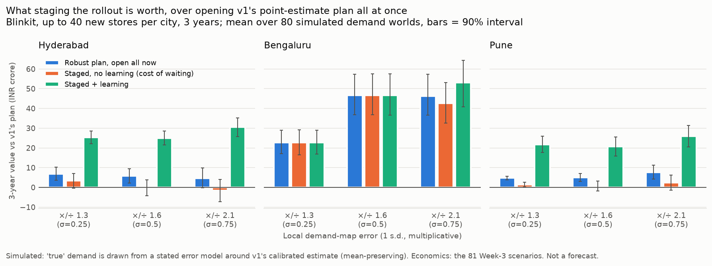

# Staged rollout: a plan that learns, instead of a list

*Code: `src/planner/rollout.py`, `scripts/plan_rollout.py`, `scripts/plot_rollout.py`. Data:
`reports/rollout_simulation_summary.csv` (per policy), `rollout_simulation_worlds.csv` (every
simulated world), `rollout_plan.csv` (the plans). Brand: Blinkit, as in v1.*

## The question

v1 answers "which sites?" from one demand estimate and opens them as if that estimate were true.
Store capex (₹2.5 Cr, disclosed steady-state incl. warehousing) is irreversible, and the demand
map is a proxy. Meanwhile the first stores a company opens *measure* demand around them.

So the real questions are:
- Which stores are safe to commit to now?
- Which should wait for evidence?
- What would that evidence need to show?
- What is waiting worth, in rupees?

## How it works

1. **Demand.** v1's calibrated orders/day per hex are the *expected* demand. The truth is
   uncertain around that estimate in three ways, all labelled assumptions:
   - a city-wide level error (σ 0.15)
   - v1's adoption-elasticity range as a tilt
   - a spatially correlated local error with a 2 km correlation length. Its size σ is swept:
     0.25, 0.5 and 0.75, i.e. local demand off by a factor of 1.3, 1.6 or 2.1 at one standard
     deviation.

   The error model is mean-preserving, so uncertainty alone never makes a plan look better.
2. **Money, not coverage.** A plan is worth:
   network-incremental orders × margin − fixed cost − capex, over 3 years.
   - Orders taken from existing stores earn nothing.
   - Margin and fixed cost come from the 81 Week-3 unit-economics scenarios; each simulated world
     draws one.
   - The planner decides how many stores to open, up to 40 per city.
3. **Served orders** use v1's capacitated assignment (each hex's orders split across stores in
   reach, up to 2,094/store/day). It is solved as a max-flow, which a test confirms matches v1's
   PuLP optimum.
4. **Policies**, all tested on the *same* 80 simulated cities per setting:

| Policy | What it does |
|---|---|
| v1 point plan | Plan on the point estimate; open everything now |
| Robust, open now | Plan on expected value over 24 demand samples; open everything now |
| Staged, no learning | Open now only sites that pay back in ≥ 90% of samples; open the rest at week 13 regardless |
| **Staged + learning** | Same wave 1. After 8 weeks of wave-1 demand, update the demand map (Bayesian, spatially correlated) and re-plan wave 2, which can shrink or expand |
| Oracle | Knows the true demand; the unreachable upper bound |

"Staged, no learning" isolates the pure cost of waiting, so the gap between it and
"staged + learning" is what the information is worth.

## Results



Gains are 3-year value vs the v1 point plan, ₹ crore, mean over 80 worlds with a paired-bootstrap
90% interval. "Loses money" is the share of simulated worlds where the policy's total 3-year
value is negative.

| City, σ | v1 plan: mean / P10 / loses money | Robust, open now | Staged, no learning | **Staged + learning** | Share of oracle gap closed |
|---|---|---|---|---|---|
| Hyderabad, 0.25 | 97.1 / −6.5 / 11% | +6.9 [3.7, 10.2] | +3.4 [−0.4, 6.9] | **+25.3** [22.1, 28.5]; P10 32.6; loses 0% | 76% |
| Hyderabad, 0.5 | 85.9 / −13.7 / 16% | +5.9 [2.1, 9.5] | −0.4 [−4.3, 3.9] | **+25.0** [21.4, 28.5]; P10 16.4; loses 2.5% | 52% |
| Hyderabad, 0.75 | 65.9 / −31.2 / 25% | +4.6 [−0.3, 9.9] | −1.6 [−7.2, 3.9] | **+30.5** [25.7, 35.2]; P10 3.2; loses 9% | 45% |
| Pune, 0.25 | 71.0 / 1.5 / 10% | +4.8 [3.9, 5.6] | +1.4 [0.2, 2.6] | **+21.8** [17.7, 25.9]; P10 33.0; loses 0% | 70% |
| Pune, 0.5 | 60.1 / −33.1 / 21% | +5.0 [3.1, 7.0] | +0.7 [−1.8, 3.2] | **+20.7** [15.8, 25.6]; P10 15.9; loses 4% | 49% |
| Pune, 0.75 | 43.7 / −44.5 / 31% | +7.7 [4.2, 11.2] | +2.4 [−1.3, 6.1] | **+25.9** [20.4, 31.3]; P10 −3.0; loses 11% | 41% |
| Bengaluru, 0.25 | 120.6 / 30.3 / 6% | +22.8 [17.0, 29.0] | +22.8 (nothing deferred) | +22.8 (nothing deferred) | — |
| Bengaluru, 0.5 | 91.9 / −23.5 / 14% | +46.6 [36.9, 57.4] | +46.6 (nothing deferred) | +46.6 (nothing deferred) | — |
| Bengaluru, 0.75 | 74.8 / −51.1 / 24% | +46.3 [36.7, 57.4] | +42.7 [32.6, 53.1] | **+53.2** [40.9, 64.4] | — |
| Hyderabad, **misspecified**¹ | 78.1 / −15.7 / 18% | +8.1 [5.0, 11.2] | +2.1 [−1.5, 5.7] | **+24.4** [20.9, 28.4]; beats v1 in 91% of worlds | — |

¹ The planner assumes σ = 0.5 with a 2 km correlation length; the truth is σ = 0.75 with 1 km,
i.e. the demand map is worse, and less spatially coherent, than the planner believes.

### What this shows

1. **Where the budget reaches past the sure bets (Hyderabad, Pune), staging with learning adds
   ₹20–30 Cr over 3 years to v1's plan, in every setting tested.**
   - The intervals are well clear of zero, and it beats v1 in 81–95% of simulated cities.
   - It cuts the share of cities where the rollout loses money from 10–31% to 0–11%.
   - It closes 41–76% of the gap to perfect information.
2. **The value comes from the learning, not the waiting.** Deferring the uncertain sites without
   using wave-1 data is worth roughly nothing (−1.6 to +3.4). Whether to wait only has an answer
   once you know what the wait will tell you.
3. **Planning on expected value alone helps a little** (+4.6 to +7.7 Cr in Hyderabad and Pune).
   Because of store capacity, value is nonlinear in demand, so the average over plausible demand
   maps picks slightly better sites than the single estimate does.
4. **Where the budget binds first (Bengaluru), staging adds nothing, and the tool says so.**
   - With 40 stores and more than 60 sites that fill a store even under pessimistic demand, every
     planned site is a sure bet. The planner commits all 40 at σ ≤ 0.5 and defers nothing.
   - The large Bengaluru gain (+23 to +47 Cr) is from robust *site choice*: v1's 40 sites fill up
     under the point estimate but not across plausible demand.
   - Only at σ = 0.75 does anything become uncertain enough to defer; learning then adds +7 Cr on
     top of the robust plan.
5. **The benefit holds when the planner's error model is wrong** (misspecified row: +24.4 Cr).
6. **A caveat: at σ = 0.75 the sample-based learner has a worse bad case than the simpler
   learner, which updates to a single best-estimate map** (P10 −3.0 vs +8.3 Cr in Pune, 3.2 vs
   10.8 in Hyderabad). It opens more stores (26 vs 20 in Pune) for a slightly higher mean. If the
   demand map is believed to be very poor, the simpler learner is the safer choice.

## The plan itself (σ = 0.5, full list in `rollout_plan.csv`)

**Wave 1: commit now** (each pays back in ≥ 90% of plausible demand maps):
- **Hyderabad:** 14 sites, led by Habib Nagar, Sanjeevaiah Nagar, Boudha Nagar, Sivaji Nagar and
  Bahadurpura. Each adds 1,858–2,094 orders/day to the network in expectation (close to a full
  store) and is worth ₹3.4–4.5 Cr over 3 years.
- **Pune:** 10 sites, led by Guruwar Peth, Ganesh Peth, Mukund Nagar, Wanawadi and Pune Cantonment
  (1,931–2,094 orders/day, ₹3.7–4.5 Cr each).
- **Bengaluru:** all 40 (see finding 4).

**Wave 2: decide at week 13, by zone** (H3 res-7, ~5 km²; sites that fill to capacity are
interchangeable within a zone). Each zone has a trigger on the wave-1 store whose demand best
predicts it:

| City | Zone (place) | Opened after learning in | Rule |
|---|---|---|---|
| Hyderabad | Goshamahal | 98% of worlds (2.3 stores) | open unless Chudi Bazaar (wave-1 #7) reads < 997 orders/day (expected 3,678) |
| Hyderabad | Vivekananda Nagar | 86% (2.6 stores) | open unless Habib Nagar (#1) reads < 1,009/day (expected 3,209) |
| Hyderabad | Asad Baba Nagar | 84% | open unless Bahadurpura (#5) reads < 1,288/day (expected 2,841) |
| Hyderabad | Saptagiri Colony | 69% | open unless Maisamma Nagar (#14) reads < 1,869/day (expected 2,276): **a close call** |
| Hyderabad | Ghulam Murtaza Nagar | 81% | pays back whatever wave 1 shows; ranked by budget |
| Pune | Maharashtra Co-op Housing Society | 89% | open unless Ram Housing Society (#7) reads < 1,235/day (expected 2,566) |
| Pune | Mahesh Society | 72% (1.9 stores) | open unless Mukund Nagar (#3) reads < 1,127/day (expected 2,980) |
| Pune | Dobarwadi | 48% | open unless Pune Cantonment (#5) reads < 699/day (expected 1,695) |
| Pune | Sadashiv Peth | 68% (3.1 stores) | pays back whatever wave 1 shows; ranked by budget |

**How to read the triggers.**
- Most are kill-switches: a zone goes ahead unless its wave-1 neighbour comes in far below
  expectation.
- The close calls, such as Saptagiri Colony, are where the 13-week wait earns its money.
- "Pays back whatever wave 1 shows" zones are limited only by the 40-store budget and by which
  other zones win it after learning.
- Each trigger is computed with only wave 1 open and the other wave-1 stores reading as expected.
  The simulated policy re-plans jointly, so treat triggers as a readable summary of that decision,
  not a replacement for it.

## Assumptions and limitations

- **This is a simulation, not a forecast.** "True" demand is drawn from an assumed error model
  around v1's estimate. The results measure the value of the *decision process* if the demand map
  is off by the stated amounts. They do not say that it is.
- **Learning assumptions.**
  - Wave-1 stores are assumed to observe the demand directed at them, including orders lost to
    capacity (operators see these as sessions or unserviceable carts).
  - Their 8-week read has a log-sd of 0.2, covering ramp-up (assumption).
  - Sites that fill to capacity reveal less in reality if lost demand isn't tracked.
- **Timing and scope.**
  - 3-year horizon, undiscounted.
  - 13 weeks from wave 1 to wave 2.
  - Existing stores stay open.
  - Competitors are held fixed, as in v1.
- **The planner is approximate.**
  - Greedy with 24 samples over the 120 best-screened candidates.
  - The Bayesian update linearises the observation at the prior. Any error from this only hurts the
    learning policies, because every policy is scored against the true demand.
- **Features.** Overture + Meta HRSL (see `revealed_demand.md`), not v1's WorldPop/OSM, so demand
  levels differ from v1's memos. Pune's study area uses the approximated core.

## Reproduce

```bash
PYTHONPATH=src python scripts/build_open_features.py      # if data/processed is empty
PYTHONPATH=src python scripts/plan_rollout.py --worlds 80  # ~50 min on 4 cores
PYTHONPATH=src python scripts/plot_rollout.py
python -m pytest tests/test_rollout.py
```
